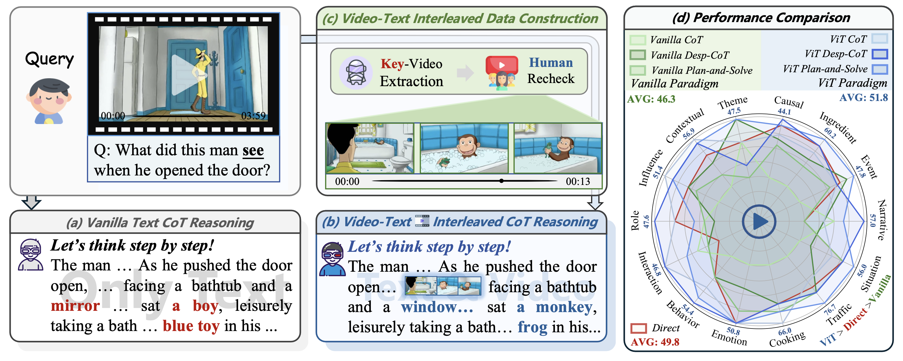
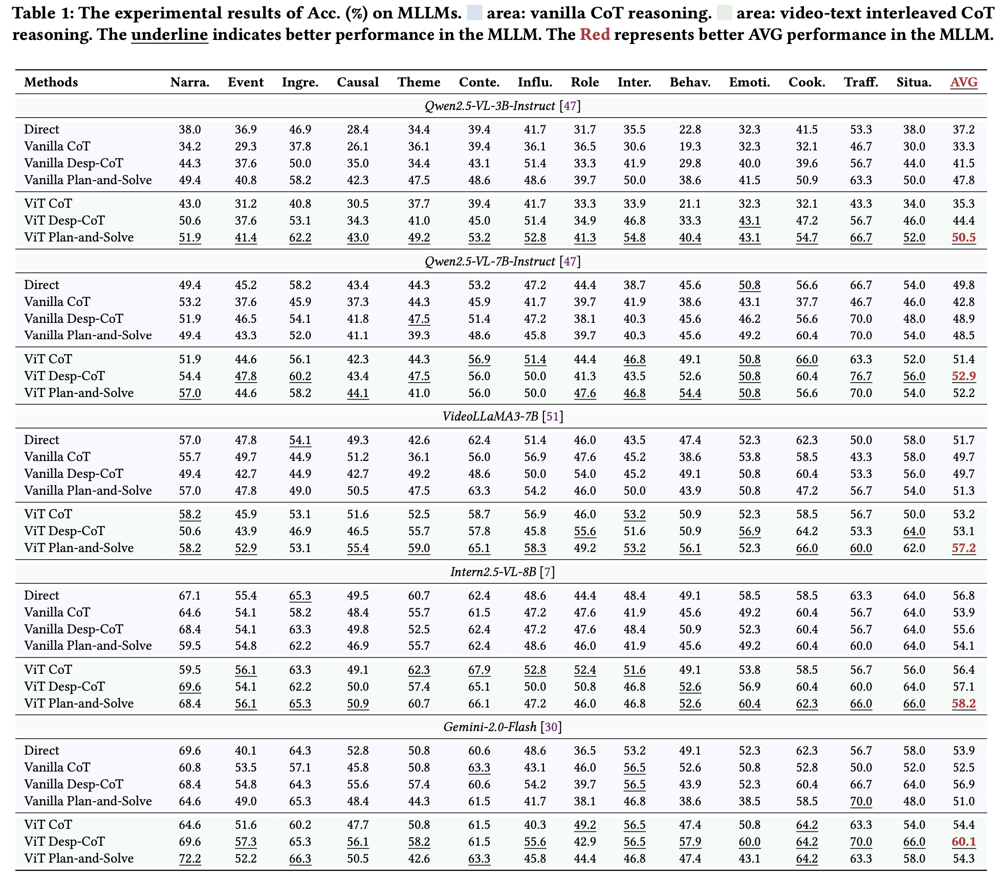

# ViTCoT: Video-Text Interleaved Chain-of-Thought for Boosting Video Understanding in Large Language Models


<div>


</div>

\
📷 This is the code repository for the paper: ViTCoT: Video-Text Interleaved Chain-of-Thought for Boosting Video Understanding in Large Language Models. **ACM MM 2025**.

<div>

</div>

Overview: (a) Vanilla Text CoT Reasoning; (b) Video-Text Interleaved CoT Reasoning; (c) **Video-Text Interleaved Data Construction**; (d) Performance Comparison: Vanilla Reasoning Paradigm (Vanilla CoT, Vanilla Desp-CoT, and Vanilla Plan-and-Solve) vs. Video-Text Interleaved Reasoning Paradigm (ViT CoT, ViT Desp-CoT and ViT Plan-and-Solve) on Qwen2.5-VL-7B.

## Preparation steps: environment installation
(1) Environment installation command:
```python
pip install -r requirements.txt
```
---
(2) Please fill in the API information in the file: `src/ViTCoT_stage1` and `src/ViTCoT_stage2`.
```python
API_KEYS = []
```

(3) **Download datasets** 🤗 [all_video.zip](https://huggingface.co/datasets/BRZ911/ViTCoT/blob/main/all_video.zip) and 🤗 [key_video.zip](https://huggingface.co/datasets/BRZ911/ViTCoT/blob/main/key_video.zip) and unzip them into the `src` folder.

## 💻 To get the performance results for Gemini-2.0-Flash, run the following command:

```python
cd src
bash run.sh
```

## 💯 Model Performance
<div>

</div>


## 💬 Contact

Please create Github issues here or email [Yongheng Zhang](mailto:zyhbrz@gmail.com) or [Libo Qin](mailto:lbqin@csu.edu.cn) if you have any questions or suggestions.

